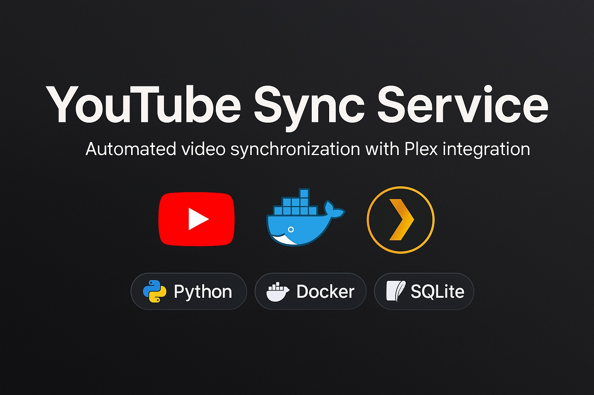

# YouTube Sync Service




Automated service for synchronizing videos from YouTube channels and playlists.

## Features

- ✅ Automatic video downloading from YouTube channels and playlists
- ✅ YAML file configuration
- ✅ File naming format "Title-YYYY-MM-DD.extension"
- ✅ Download in best available quality
- ✅ Individual period settings for each source
- ✅ Built-in yt-dlp filters for efficiency
- ✅ Plex Media Server compatibility
- ✅ Docker containerization
- ✅ Scheduler for automatic synchronization
- ✅ Full operation logging

## Use Cases

### 🏠 Home Media Server
- **Automatic synchronization** of favorite YouTube channels for offline viewing
- **Integration with Plex/Jellyfin** for organizing video collections
- **Traffic savings** - download during unlimited internet hours

### 📚 Educational Content
- **Save courses and lectures** from educational channels
- **Create local library** for offline learning
- **Archive** important content that might be deleted

### 🎬 Content Creators
- **Monitor competitors** - automatic download of new videos
- **Create collections** of videos by topic for trend analysis
- **Backup own content** from backup channels

### 🏢 Corporate Use
- **Archive** corporate YouTube channels
- **Compliance** requirements for content preservation
- **Content analytics** for marketing research

### 🌐 Geographic Restrictions
- **Bypass blocks** - download via VPN for later viewing
- **Save** region-blocked content
- **Access content** in areas with poor internet

## Quick Start

### 1. User Setup

Create a `.env` file to configure UID/GID:

```bash
# Find your UID and GID
id -u  # UID
id -g  # GID

# Create .env file
cp .env.example .env
# Edit values in .env file
```

### 2. Configuration Setup

Edit the `config.yaml` file:

```yaml
youtube:
  channels:
    - url: "https://www.youtube.com/@yourchannel1"
      period_days: 30  # Download from last 30 days
      output_dir: "./downloads/CHANNEL1"  # Individual folder
    - url: "https://www.youtube.com/@yourchannel2"
      period_days: 14  # Download from last 2 weeks
      output_dir: "./downloads/CHANNEL2"

  playlists:
    - url: "https://www.youtube.com/playlist?list=PLyour_playlist"
      period_days: 60  # Download from last 2 months
      output_dir: "./downloads/playlists/MY_PLAYLIST"

download:
  output_dir: "./downloads"  # Default folder
  quality: "bestvideo[height<=1080][ext=mp4]+bestaudio[ext=m4a]/bestvideo[height<=1080]+bestaudio/best[height<=1080][ext=mp4]/best[height<=720]/best"
  default_period_days: 30
  plex_naming: true  # Plex Media Server compatibility

scheduler:
  sync_interval_hours: 6
  first_run_time: "08:00"
```

### 3. Docker Compose Launch

```bash
# Build and run
docker-compose up -d

# View logs
docker-compose logs -f ytsync

# Stop
docker-compose down
```

### 4. Run without Docker

```bash
# Install dependencies
pip install -r requirements.txt

# Run service
python main.py
```

## Configuration Format

```yaml
youtube:
  channels:
    - url: "https://www.youtube.com/@channel"
      period_days: 30
  playlists:
    - url: "https://www.youtube.com/playlist?list=list"
      period_days: 60
```

## Project Structure

```
ytsync/
├── main.py              # Main service code
├── config.yaml          # Configuration
├── requirements.txt     # Python dependencies
├── Dockerfile          # Docker image
├── docker-compose.yml  # Docker Compose configuration
├── db/                 # SQLite database
│   └── ytsync.db       # Downloaded videos information storage
└── downloads/          # Downloaded videos folder
```

## Configuration Settings

### YouTube Sources
- `channels` - list of channels to synchronize
  - `url` - channel URL
  - `period_days` - download period for this channel (optional)
- `playlists` - list of playlists to synchronize
  - `url` - playlist URL
  - `period_days` - download period for this playlist (optional)

### Download Settings
- `output_dir` - folder for saving videos
- `quality` - download quality (see "Video Quality Settings" section)
- `max_file_size` - maximum file size in MB (0 = no limit)
- `max_duration` - maximum duration in seconds (0 = no limit)
- `default_period_days` - default download period if not specified for specific source (30 days)
- `max_videos_per_source` - maximum number of videos to process per source (0 = auto: period_days * 3, minimum 10)
- Automatic Plex-compatible file naming

## Video Quality Settings

The `quality` parameter supports complex yt-dlp formats for optimal quality selection:

### Recommended Settings

**High quality (1080p preferred, 720p minimum):**
```yaml
quality: "bestvideo[height<=1080][ext=mp4]+bestaudio[ext=m4a]/bestvideo[height<=1080]+bestaudio/best[height<=1080][ext=mp4]/best[height<=720]/best"
```

**Standard quality (720p maximum):**
```yaml
quality: "bestvideo[height<=720][ext=mp4]+bestaudio[ext=m4a]/best[height<=720]/best"
```

**Traffic saving (480p maximum):**
```yaml
quality: "bestvideo[height<=480]+bestaudio/best[height<=480]/best"
```

### Format Explanation

- `bestvideo[height<=1080][ext=mp4]` - best video up to 1080p in MP4 format
- `bestaudio[ext=m4a]` - best audio in M4A format
- `+` - combine video and audio streams
- `/` - alternative option if first is unavailable
- `best[height<=720]` - combined format up to 720p (fallback)

### Additional Filters

You can also add additional restrictions:
- `[fps<=30]` - frame rate limitation
- `[filesize<500M]` - file size limitation
- `[vcodec^=avc1]` - specific codec preference

### Scheduler
- `sync_interval_hours` - interval between synchronizations in hours
- `first_run_time` - first run time in "HH:MM" format

## File Naming

### Standard Format
Files are saved in format: `Video Title-YYYY-MM-DD.extension`

Examples:
- `New Phone Review-2024-06-22.mp4`
- `Programming Tutorial-2024-06-21.mp4`

### Plex-Compatible Format
Files are automatically organized in Plex-compatible structure:

```
downloads/
├── ChannelName/
│   ├── Season 2024/
│   │   ├── ChannelName – 2024-06-22 – New Phone Review.mp4
│   │   └── ChannelName – 2024-06-21 – Programming Tutorial.mp4
│   └── Season 2023/
│       └── ChannelName – 2023-12-15 – Old Video.mp4
└── AnotherChannel/
    └── Season 2024/
        └── AnotherChannel – 2024-06-20 – Another Video.mp4
```

This ensures full compatibility with Plex Media Server for automatic metadata recognition.

## Monitoring

Logging levels:
- `INFO` - general operation information
- `ERROR` - download errors
- `DEBUG` - detailed debug information

## Database

The service uses SQLite database to track already downloaded videos and prevent duplication:

- **Location**: `./db/ytsync.db`
- **Purpose**: Store information about downloaded videos, their IDs and download times
- **Auto-creation**: Database is created automatically on first run
- **Reset**: Delete `ytsync.db` file for complete re-synchronization

## Plex Compatibility

The service is configured for maximum compatibility with Plex Media Server:
- MP4 format priority
- FFmpeg usage for conversion
- Compatible video/audio codecs
- Efficient filtering through built-in yt-dlp parameters
- **Plex-compatible file naming**
  - Folder structure: `ChannelName/Season YYYY/`
  - File format: `ChannelName – YYYY-MM-DD – VideoTitle.ext`
  - Automatic video grouping by years as "seasons"
  - Full compliance with Plex standards for date-based TV shows

## Requirements

- Python 3.11+
- FFmpeg (installed automatically in Docker)
- Internet connection
- ~1GB free disk space for temporary files

## User Configuration

For proper file access permissions, you need to configure user UID/GID in the container.

### Method 1: Via .env file (recommended)

```bash
# .env
USER_UID=1001
USER_GID=1001
```

### Method 2: Via build arguments

```bash
docker build --build-arg USER_UID=$(id -u) --build-arg USER_GID=$(id -g) -t ytsync .
```

### Method 3: Via docker-compose directly

```yaml
# docker-compose.yml
services:
  ytsync:
    build:
      context: .
      args:
        USER_UID: 1001
        USER_GID: 1001
```

### Permission Check

```bash
# Check downloaded files owner
ls -la downloads/

# Should show your user:
# drwxr-xr-x 2 username usergroup 4096 Jun 22 10:30 downloads/
```

## Folder Structure

```
downloads/
├── CHANNEL1/                   # First channel videos
├── CHANNEL2/                   # Second channel videos
└── playlists/
    ├── MY_PLAYLIST/           # Specific playlist videos
    └── ANOTHER_PLAYLIST/      # Another playlist videos
```

## CI/CD and Automation

The project includes a complete CI/CD pipeline using GitHub Actions and GitHub Container Registry (ghcr.io):

### CI/CD Features:
- ✅ Automatic code testing and linting
- ✅ Security scanning (Bandit, Trivy)
- ✅ Multi-platform Docker image builds (amd64, arm64)
- ✅ Automatic publishing to GitHub Container Registry
- ✅ SSH-based deployment to self-hosted servers
- ✅ Build caching for faster builds

### Using Pre-built Images:
```bash
# Using pre-built image
docker run -d \
  --name ytsync \
  -v $(pwd)/config.yaml:/app/config.yaml \
  -v $(pwd)/downloads:/app/downloads \
  -v $(pwd)/db:/app/db \
  ghcr.io/your-username/ytsync:latest
```

### CI/CD Setup:
Detailed setup instructions are available in [.github/SETUP.md](.github/SETUP.md)

## FAQ / Frequently Asked Questions

### ❓ General Questions

**Q: Does the service support platforms other than YouTube?**
A: Currently only YouTube is supported. Support for other platforms may be added in future versions.

**Q: Can it download private videos?**
A: No, the service only works with publicly available videos. Private videos and restricted content are not accessible.

**Q: How often does synchronization occur?**
A: Every 6 hours by default. The interval is configurable via `sync_interval_hours` parameter.

### ⚙️ Setup and Configuration

**Q: How to change video quality?**
A: Configure the `quality` parameter in the `download` section. See "Video Quality Settings" section for examples.

**Q: Can I limit file size of downloads?**
A: Yes, use `max_file_size` and `max_duration` parameters in the `download` section.

**Q: How to set individual folders for channels?**
A: Add `output_dir` parameter for each channel or playlist in the configuration.

### 🐳 Docker and Deployment

**Q: Why are files created with wrong permissions?**
A: Configure UID/GID in `.env` file according to your user (see "User Configuration" section).

**Q: Can I run multiple instances of the service?**
A: Yes, but ensure they use different download folders and databases.

**Q: How to update to a new version?**
A: Stop container, run `docker-compose pull`, then `docker-compose up -d`.

### 🔧 Troubleshooting

**Q: "HTTP Error 429" or "Too Many Requests" error**
A: YouTube limits request rate. Increase sync interval or add delays.

**Q: Videos download but don't appear in Plex**
A: Check folder structure - service automatically creates Plex-compatible structure "Season YYYY/Uploader - YYYY-MM-DD - Title.ext".

**Q: Service doesn't download new videos**
A: Check logs for errors, ensure channels are active, verify `period_days` settings.

**Q: High resource consumption**
A: Limit `max_videos_per_source`, increase `sync_interval_hours`, use Docker resource limits.

### 📊 Performance

**Q: How much space does the database take?**
A: SQLite database takes minimal space - usually a few MB even for thousands of videos.

**Q: How to speed up downloads?**
A: Configure download quality, use file size filters, limit videos per source.

**Q: How to clear downloaded videos from database?**
A: Delete `db/ytsync.db` file for complete reset or use SQL queries for selective cleanup.

### 🆘 Get Help

**Didn't find answer to your question?**
- Create issue using [bug report template](.github/ISSUE_TEMPLATE/bug_report.md)
- Suggest improvement via [feature request](.github/ISSUE_TEMPLATE/feature_request.md)
- Check [contributing guide](CONTRIBUTING.md)

## Troubleshooting

### 🔍 Problem Diagnosis

**1. Check logs**
```bash
# Docker
docker-compose logs -f ytsync

# Without Docker
python main.py  # Logs output to console
```

**2. Check configuration**
```bash
# YAML validation
python -c "import yaml; yaml.safe_load(open('config.yaml'))"
```

**3. Check YouTube availability**
```bash
# Test simple download
yt-dlp --no-download "https://www.youtube.com/watch?v=dQw4w9WgXcQ"
```

### ⚠️ Common Issues

| Symptom | Possible Cause | Solution |
|---------|---------------|----------|
| 403/429 errors | YouTube blocking | Increase delays, use VPN |
| Empty files | FFmpeg issues | Check FFmpeg installation |
| Wrong permissions | Incorrect UID/GID | Configure `.env` file |
| No Plex folders | Access permission issues | Check download folder permissions |
| Video duplication | Database issues | Check `db/` folder permissions |
| High load | Too many sources | Limit sources or frequency |

### 🔄 Recovery Procedures

**Reset database:**
```bash
rm -f db/ytsync.db
# Database will be recreated on next run
```

**Clear Docker cache:**
```bash
docker system prune -f
docker-compose build --no-cache
```

**Restore configuration:**
```bash
cp config.yaml config.yaml.backup
# Restore from backup or create new one
```

## Contributing

We welcome contributions! Please see our [Contributing Guide](CONTRIBUTING.md) for details.

**Quick Start for Contributors:**
1. Fork the repository
2. Create a feature branch
3. Make your changes with tests
4. Run quality checks: `black --check main.py && pylint main.py`
5. Submit a pull request

## Changelog

See [CHANGELOG.md](CHANGELOG.md) for a complete list of changes, new features, and version history.

## Security

- Service runs as unprivileged user
- Configurable UID/GID for proper access permissions
- Resource limitations in Docker
- Safe filename handling
- Automatic container vulnerability scanning
- Code security checks on every commit

## License

This project is licensed under the MIT License. See the [LICENSE](LICENSE) file for details.

**What this means:**
- ✅ Free to use in personal and commercial projects
- ✅ Modify and distribute the code
- ✅ Create derivative works
- ⚠️ Attribution required
- ⚠️ Provided "as is" without warranties
